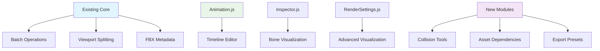

# Список рекомендуемых фич для 3D Viewer (приоритизировано)

Документ собран с учётом существующих возможностей просмотрщика, описанных в [`docs/PROJECT.md`](docs/PROJECT.md:1) и текущих модулей (Inspector, polygon selection, AssetLoader и т.д.).

## Критичные / очень полезные (внедрить в первую очередь)

### 1. Undo / Redo для операций сцены
- **Почему полезно**: Пользователи часто делают ошибочные перемещения/удаления. Восстановление без перезагрузки сцены.
- **Как реализовать**: Централизовать стек команд в [`src/core/StateManager.js`](src/core/StateManager.js:1) + эмитить события через [`src/core/EventSystem.js`](src/core/EventSystem.js:1).
  Каждое действие (перемещение, удаление, переименование, attach/detach в Inspector [`src/Inspector.js`](src/Inspector.js:11)) — команда с undo/redo.
- **Точки интеграции**: Обернуть текущие операции в Inspector (действия duplicate/delete/attach) и TransformControls ([`src/TransformControls.js`](src/TransformControls.js:1)).
- **Hotkey**: Ctrl+Z / Ctrl+Y.

### 2. Сохранение/загрузка сцены (экспорт/импорт)
- **Форматы**: glTF/GLB для модели + .viewer.json для метаданных (камера, выделение, render settings из [`src/RenderSettings.js`](src/RenderSettings.js:1), UI state).
- **Почему полезно**: Удобный обмен сценами и восстановление состояния.
- **Интеграция**: Экспорт через Three.js GLTFExporter; сохранить метаданные. Импорт через существующий `AssetLoader` ([`src/core/AssetLoader.js`](src/core/AssetLoader.js:1)).
- **Кнопки**: Добавить в toolbar (рядом с Load model).

### 3. Camera bookmarks / Presets (сокеты камер)
- **Почему полезно**: Часто нужно вернуться к определённым видам/ракурсам.
- **Реализация**: UI в боковой панели (новая collapsible секция); хранить в `localStorage` через [`src/Settings.js`](src/Settings.js:1) или в `StateManager`.
- **Интеграция**: Привязать к hotkeys через [`docs/HOTKEYS_GUIDE.md`](docs/HOTKEYS_GUIDE.md:1) (Ctrl+1-9 для сохранения, Shift+1-9 для загрузки).

### 4. Быстрый export изображения (PNG) и high-res/transparent
- **Почему полезно**: Сохранить скриншот сцены/альфу для презентаций.
- **Реализация**: Рендер в offscreen canvas или увеличить разрешение временно в [`src/Renderer.js`](src/Renderer.js:1), затем toDataURL.
- **Настройки**: Поддержать transparent (фон transparent в [`index.html`](index.html:1)), разрешение 2x/4x.
- **Кнопка**: В render settings секции или отдельная.

## Практичные улучшения (повышают удобство и производительность)

### 5. Управление уровнями / слоями / visibility groups
- **Почему полезно**: Сложные сцены требуют группировки объектов.
- **Реализация**: Добавить группы в Inspector (`src/Inspector.js:1`) и возможность включать/выключать entire layer; хранить в `StateManager`.
- **UI**: Drag&drop объекты в группы в Inspector tree.

### 6. Selection sets / Saved selections
- **Почему полезно**: Быстро переключаться между наборами выделенных объектов.
- **Реализация**: В `Inspector` — сохранять массив UUID, давать имя, восстанавливать выделение (с кнопками в sidebar).
- **Хранение**: `localStorage` или scene metadata.

### 7. Полная редакция материалов (PBR)
- **Почему полезно**: Сейчас есть переключение материалов (см. `mat-override` в [`index.html`](index.html:1]), но нет редактора PBR.
- **Реализация**: Панель редактирования параметров: albedo/metalness/roughness/normal/intensity и live preview.
- **Интеграция**: Привязать к `Materials.js` (`src/Materials.js` с новыми sliders).

### 8. Texture browser / replace + drag&drop textures
- **Почему полезно**: Удобная назначаемость текстур.
- **Реализация**: Расширить `zipTextures` и UI в секции Textures (`index.html`) для drag&drop на материалы/слоты (используя существующий ZIP support в [`src/utils/zipTextures.js`](src/utils/zipTextures.js:1)).

### 9. Measurement tool — улучшения
- **Дополнения**: Snap-to-vertex/edge, units переключение (mm/cm/m), area/angle measurement.
- **Почему полезно**: Текущая панель измерений (`measure-toggle` в [`index.html`](index.html:1)) базовая.
- **Интеграция**: Расширить `scene.measure` (используется в `Inspector.js`) с snapping.

### 10. Cut plane / Section view (clipping plane)
- **Почему полезно**: Показывает внутренние части модели.
- **Реализация**: Three.js clippingPlanes в [`src/Renderer.js`](src/Renderer.js:1), контролы для перемещения плоскости в UI с привязкой к transform gizmo.

## Инструменты для контента и анализа

### 11. Visualize normals / tangents / UV overlay / vertex colors
- **Почему полезно**: Диагностика модели важна для работы с FBX.
- **Реализация**: Режимы отображения в `RenderSettings.js` (wireframe/vertex-normals/uv) и быстрый toggle в UI.

### 12. Scene statistics & memory profiler
- **Метрики**: Triangles count, draw calls, texture memory estimate, FPS history.
- **Интеграция**: Расширить debug-bar (`index.html` chips) и собрать stats через Renderer (WebGL info).

### 13. LOD generation / decimation (basic)
- **Почему полезно**: Тестирование производительности и экспорта лёгких версий.
- **Реализация**: Интегрировать decimation library (simple edge-collapse) и сохранить LODs как дети модели.

## UX / collaboration / pro-features

### 14. Annotations / comments
- **Почему полезно**: Удобнее объяснять/помечать артефакты.
- **Реализация**: UI для создания аннотаций (position в world space), хранение в scene metadata, экспорт вместе со сценой.

### 15. Multi-model compare / split-view
- **Почему полезно**: Проверка изменений между версиями FBX.
- **Реализация**: Поддержка загрузки второго model slot и режим Split/Toggle; API в `Application.create()` ([`src/core/Application.js`](src/core/Application.js:1)).

### 16. Morph target / blendshape preview controls
- **Почему полезно**: FBX часто содержит blendshapes.
- **Интеграция**: В `Animation.js` и Inspector — показать sliders для morphTargetInfluences.

### 17. Automated unit conversion and import warnings
- **Почему полезно**: FBX часто в разных единицах — проблемы с размером.
- **Реализация**: При загрузке в `AssetLoader` проверять размер модели и предлагать масштаб/convert.

## Developer / extensibility features

### 18. Plugin API / extension points (simple)
- **Почему полезно**: Расширяемость без костылей в коде.
- **Реализация**: Expose lifecycle events через [`src/core/EventSystem.js`](src/core/EventSystem.js:1), пример plugin с hotkeys.

### 19. Batch import / drag&drop multiple models with auto-arrange
- **Почему полезно**: Ускоряет работу с юнитами ассетов.
- **Реализация**: AssetLoader already handles files; add auto-arrange grid placement + group creation.

### 20. Automated tests for loaders (smoke tests)
- **Почему полезно**: Стабилизировать поддержку форматов (FBX/GLTF/OBJ).
- **Реализация**: Lightweight headless tests or in-browser fixtures; create tasks in `tasks/`.

## Небольшие, но заметные улучшения UI / polish

### 21. Camera orbit smoothing / adjustable damping
- **Интеграция**: Tie to [`index.html` movement-sensitivity](index.html:1) с новым slider.

### 22. Keyboard custom hotkeys mapping UI
- **Персистент**: Extend [`docs/HOTKEYS_GUIDE.md`](docs/HOTKEYS_GUIDE.md:1) patterns into runtime UI.

### 23. Toggle for auto-play animations on load
- **Per-model**: Current default off; make per-model setting в [`src/Animation.js`](src/Animation.js:1).

### 24. Contextual help / guided tips
- **Для новичков**: Small onboarding panel для advanced tools (polygon selection, isolate, attach).

## Рекомендации по приоритетам

### Внедрить первым (высокий impact/низкая сложность):
1. **Undo/Redo** · 2. **Scene save/load экспорт** · 3. **Camera bookmarks** · 4. **PNG export**.

### Далее (средний приоритет):
5. **PBR material editor** · 6. **Measurement improvements** · 9. **Clipping plane** · 10. **Selection sets**.

### Более крупные/отложенные:
11. **LOD/decimation** · 15. **Multi-model compare** · 18. **Plugin API** · 20. **Automated tests**.

## Технические точки входа (быстрое руководство)

- **Подписка/вызовы**: `EventSystem` ([`src/core/EventSystem.js`](src/core/EventSystem.js:1)) для коммуникации новых инструментов.
- **Централизованное состояние**: Расширяйте `StateManager` ([`src/core/StateManager.js`](src/core/StateManager.js:1)) для undo/scene-presets/bookmarks.
- **UI**: Добавить элементы в `index.html` (панели структурированы; секции легко расширить) и связать через [`src/UI.js`](src/UI.js:1).
- **Логирование**: Следовать `Logger` правилам ([`docs/LOGGING_GUIDELINES.md`](docs/LOGGING_GUIDELINES.md:1)) при добавлении debug output.

---

## Дополнительные функции для FBX просмотрщика

### Критичные/очень полезные (дополнения к приоритетным)

#### 25. **Batch операции для выделенных объектов**
- **Почему полезно**: Сейчас есть polygon selection, но нет массовых операций
- **Реализация**: Расширить [`src/Inspector.js`](src/Inspector.js:11) - batch rename, batch material assignment, batch transform
- **Интеграция**: Использовать существующий selection system и добавить контекстное меню

#### 26. **Viewport splitting / Multi-camera views**
- **Почему полезно**: Одновременный просмотр с разных ракурсов (Front/Side/Top/Perspective)
- **Реализация**: Разделить canvas на квадранты в [`src/Renderer.js`](src/Renderer.js:1), каждый со своей камерой
- **UI**: Toggle между single/quad view

#### 27. **Animation timeline с keyframe editing**
- **Почему полезно**: Сейчас есть [`src/Animation.js`](src/Animation.js:1), но только playback
- **Реализация**: Визуальный timeline, scrubbing, keyframe markers
- **Интеграция**: Расширить существующий animation UI

### Специфичные для FBX/3D workflow

#### 28. **Bone/Joint visualization и IK chains**
- **Почему полезно**: FBX часто содержит скелеты - нужна визуализация
- **Реализация**: Отображение костей как wireframe, highlight IK chains
- **Интеграция**: В [`src/RenderSettings.js`](src/RenderSettings.js:1) добавить toggle для skeleton display

#### 29. **Texture atlas preview и UV unwrapping visualization**
- **Почему полезно**: Диагностика UV mapping проблем
- **Реализация**: Отдельное окно с UV layout, highlight selected faces
- **Интеграция**: Связать с polygon selection system

#### 30. **FBX metadata inspector**
- **Почему полезно**: FBX содержит много метаданных (версия, софт, настройки экспорта)
- **Реализация**: Панель в [`src/Inspector.js`](src/Inspector.js:11) с FBX-специфичной информацией
- **Данные**: Creation time, software version, units, coordinate system

### Производительность и оптимизация

#### 31. **Frustum culling visualization**
- **Почему полезно**: Отладка производительности рендеринга
- **Реализация**: Показать что находится в frustum камеры
- **Интеграция**: Debug overlay в [`src/Renderer.js`](src/Renderer.js:1)

#### 32. **Texture compression preview**
- **Почему полезно**: Сравнение качества/размера текстур
- **Реализация**: Показать оригинал vs compressed (DXT/ETC/ASTC)
- **Интеграция**: Расширить texture browser (#8 из списка)

#### 33. **Memory usage tracker в реальном времени**
- **Почему полезно**: Отслеживание утечек памяти
- **Реализация**: График использования GPU/CPU памяти
- **Интеграция**: Расширить debug bar в [`index.html`](index.html:1)

### Workflow и интеграция

#### 34. **Asset dependency graph**
- **Почему полезно**: Понимание связей между текстурами, материалами, мешами
- **Реализация**: Граф зависимостей с возможностью навигации
- **UI**: Отдельная панель или расширение Inspector

#### 35. **Export presets для разных движков**
- **Почему полезно**: Быстрый экспорт для Unity/Unreal/Godot с правильными настройками
- **Реализация**: Предустановки в [`src/core/AssetLoader.js`](src/core/AssetLoader.js:1)
- **Форматы**: Разные настройки компрессии, coordinate systems, scale

#### 36. **Version control integration (Git LFS preview)**
- **Почему полезно**: Работа с версионированными 3D ассетами
- **Реализация**: Показать diff между версиями моделей
- **Интеграция**: Расширение multi-model compare (#15)

### Специализированные инструменты

#### 37. **Collision mesh generation и preview**
- **Почему полезно**: Создание упрощенных collision meshes
- **Реализация**: Автогенерация convex hull, box, sphere colliders
- **Визуализация**: Overlay поверх основной модели

#### 38. **Lightmap UV generation и preview**
- **Почему полезно**: Подготовка для static lighting
- **Реализация**: Автоматическая генерация второго UV канала
- **Интеграция**: Связать с UV visualization (#29)

#### 39. **Animation retargeting preview**
- **Почему полезно**: Применение анимаций между разными скелетами
- **Реализация**: Mapping костей, preview результата
- **Требования**: Два loaded models с скелетами

### Accessibility и UX

#### 40. **Colorblind-friendly visualization modes**
- **Почему полезно**: Доступность для пользователей с нарушениями цветовосприятия
- **Реализация**: Альтернативные цветовые схемы для selection, wireframe
- **Интеграция**: В [`src/RenderSettings.js`](src/RenderSettings.js:1)

#### 41. **Voice commands для основных операций**
- **Почему полезно**: Hands-free работа, accessibility
- **Реализация**: Web Speech API для команд типа "select all", "frame view"
- **Интеграция**: Расширение hotkey system

#### 42. **Touch/mobile support**
- **Почему полезно**: Просмотр на планшетах/телефонах
- **Реализация**: Touch gestures для orbit/pan/zoom, mobile UI
- **Адаптация**: Responsive design для [`index.html`](index.html:1)

## Приоритизация дополнительных функций

### Высокий приоритет (дополнить к первоочередным):
- **#25 Batch операции** - расширяет существующий selection
- **#28 Bone visualization** - критично для FBX с анимациями  
- **#30 FBX metadata** - быстро реализуется, очень полезно

### Средний приоритет:
- **#26 Viewport splitting** - профессиональная функция
- **#27 Animation timeline** - логичное развитие Animation.js
- **#37 Collision mesh** - практичная функция для gamedev

### Низкий приоритет/специализированные:
- **#36 Version control** - для продвинутых workflow
- **#39 Animation retargeting** - сложная реализация
- **#41 Voice commands** - экспериментальная функция

## Mermaid диаграмма архитектуры расширений

Эти дополнения хорошо интегрируются с существующей архитектурой и расширяют функциональность в областях, которые не были покрыты в оригинальном списке.