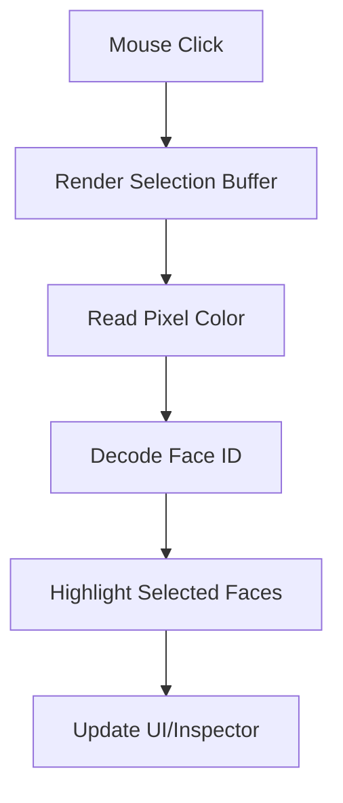
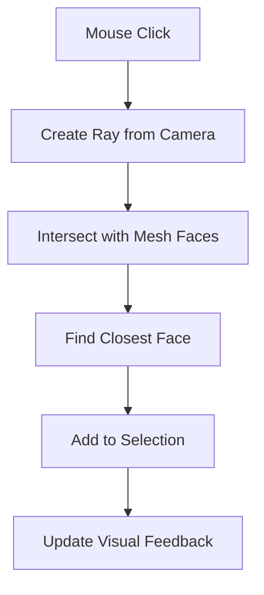

# Задача: Реализация системы Polygonal Selection (Полигональное выделение)

## Цель
Реализовать функциональность выделения отдельных полигонов (граней) 3D-моделей в приложении, предоставляя пользователю возможность интерактивного выбора и визуальной обратной связи.

## Текущее состояние системы выделения
В проекте уже существует базовая система выделения объектов, которая использует raycasting для выбора целых объектов и `OutlinePass` для их подсветки.

- [`UIBindings.bindPicking()`](src/core/UIBindings.js:150): Обработка кликов мыши для определения координат на канвасе.
- [`Application.handleContextMenu()`](src/core/Application.js:576): Использование `THREE.Raycaster` для определения пересечений с объектами сцены.
- [`RendererManager.setOutlineObjects()`](src/Renderer.js:118): Управление подсветкой выделенных объектов с помощью `OutlinePass`.

## Архитектурные подходы к реализации Polygonal Selection

### 1. **GPU-based Selection (Рекомендуемый)**
Этот подход обеспечивает высокую производительность и точность, особенно для сложных моделей.



**Принцип работы:**
1.  **Рендеринг в буфер ID:** Сцена рендерится в отдельный буфер (render target), где каждый полигон окрашивается в уникальный цвет, представляющий его ID.
2.  **Чтение пикселя:** При клике мыши считывается цвет пикселя под курсором из этого буфера.
3.  **Декодирование ID:** Цвет декодируется обратно в ID полигона.
4.  **Выделение:** Найденный полигон добавляется в список выделенных и визуально подсвечивается.

**Преимущества:**
-   Высокая производительность, так как большая часть работы выполняется на GPU.
-   Точное выделение независимо от сложности геометрии.
-   Масштабируется с количеством полигонов.

**Пример концептуальной реализации:**
```javascript
class PolygonalSelectionManager {
  constructor(renderer, scene, camera) {
    this.renderer = renderer;
    this.scene = scene;
    this.camera = camera;
    
    // Создаем отдельный буфер для рендеринга ID
    this.selectionRenderTarget = new THREE.WebGLRenderTarget(
      window.innerWidth, 
      window.innerHeight,
      {
        minFilter: THREE.LinearFilter,
        magFilter: THREE.NearestFilter,
        format: THREE.RGBAFormat,
        type: THREE.UnsignedByteType
      }
    );
    
    this.selectionScene = new THREE.Scene(); // Сцена для рендеринга ID
    this.selectedFaces = new Map(); // Map<mesh.uuid, Set<faceIndex>>
    this.originalMaterials = new Map(); // Для восстановления материалов
  }
  
  // Создаем копию меша с материалами, кодирующими ID полигонов
  prepareMeshForSelection(mesh) {
    const selectionMesh = mesh.clone();
    selectionMesh.material = mesh.material; // Сохраняем оригинальный материал
    
    selectionMesh.traverse((child) => {
      if (child.isMesh && child.geometry) {
        // Сохраняем оригинальные материалы для восстановления
        this.originalMaterials.set(child.uuid, child.material);

        const faceCount = child.geometry.index ? child.geometry.index.count / 3 : child.geometry.attributes.position.count / 3;
        const materials = [];
        for (let i = 0; i < faceCount; i++) {
          const color = this.encodeIdToColor(i);
          materials.push(new THREE.MeshBasicMaterial({ color }));
        }
        // Присваиваем каждому полигону свой материал с уникальным цветом
        child.material = materials;
        child.geometry.groups.forEach((group, index) => {
          group.materialIndex = index; // Каждый полигон - отдельная группа
        });
      }
    });
    this.selectionScene.add(selectionMesh);
  }

  // Кодируем ID полигона в цвет (RGB)
  encodeIdToColor(id) {
    const r = (id >> 16) & 0xFF;
    const g = (id >> 8) & 0xFF;
    const b = id & 0xFF;
    return new THREE.Color(r / 255, g / 255, b / 255);
  }
  
  // Декодируем цвет обратно в ID
  decodeColorToId(color) {
    return (Math.round(color.r * 255) << 16) + 
           (Math.round(color.g * 255) << 8) + 
           Math.round(color.b * 255);
  }

  // Выполняем рендеринг в буфер выделения и считываем пиксель
  pick(x, y) {
    this.renderer.setRenderTarget(this.selectionRenderTarget);
    this.renderer.render(this.selectionScene, this.camera);

    const pixelBuffer = new Uint8Array(4);
    this.renderer.readRenderTargetPixels(
      this.selectionRenderTarget,
      x,
      this.selectionRenderTarget.height - y, // Y-координата инвертирована
      1,
      1,
      pixelBuffer
    );

    this.renderer.setRenderTarget(null); // Возвращаем рендеринг на основной канвас

    const id = (pixelBuffer[0] << 16) | (pixelBuffer[1] << 8) | pixelBuffer[2];
    return id; // Возвращаем ID полигона
  }

  // Добавляем/удаляем полигон из выделения
  togglePolygonSelection(mesh, faceIndex, additive = false) {
    if (!additive) {
      this.clearSelection();
    }

    const meshUuid = mesh.uuid;
    if (!this.selectedFaces.has(meshUuid)) {
      this.selectedFaces.set(meshUuid, new Set());
    }
    const faces = this.selectedFaces.get(meshUuid);

    if (faces.has(faceIndex)) {
      faces.delete(faceIndex);
    } else {
      faces.add(faceIndex);
    }
    this.updateVisualFeedback();
  }

  // Обновляем визуальное отображение выделенных полигонов
  updateVisualFeedback() {
    // Здесь можно использовать OutlinePass или создать отдельные меши для выделения
    // Для OutlinePass потребуется передать список выделенных граней
    // Или создать временные меши для каждого выделенного полигона и добавить их в сцену
  }

  clearSelection() {
    this.selectedFaces.clear();
    this.updateVisualFeedback();
  }
}
```

### 2. **CPU-based Raycasting Selection**
Этот подход проще в реализации, но может быть менее производительным для очень плотных мешей.



**Принцип работы:**
1.  **Создание луча:** При клике мыши создается луч, исходящий из камеры в направлении курсора.
2.  **Пересечение с гранями:** `THREE.Raycaster` используется для определения пересечений луча с гранями 3D-моделей.
3.  **Определение полигона:** Из результатов пересечения выбирается ближайший полигон.
4.  **Выделение:** Найденный полигон добавляется в список выделенных.

**Преимущества:**
-   Проще в реализации, так как использует существующий механизм `THREE.Raycaster`.
-   Не требует дополнительных рендер-таргетов.
-   Легко интегрируется с существующим кодом.

**Расширение существующего raycasting (в `Application.js`):**
```javascript
// В Application.js, расширяем handleContextMenu
handlePolygonSelection = ({ clientX, clientY, addToSelection = false }) => {
  const raycaster = new THREE.Raycaster();
  const mouse = new THREE.Vector2();
  const rendererDom = this.rendererManager?.renderer?.domElement;
  
  if (!rendererDom) return;
  const rect = rendererDom.getBoundingClientRect();

  mouse.x = ((clientX - rect.left) / rect.width) * 2 - 1;
  mouse.y = -((clientY - rect.top) / rect.height) * 2 + 1;

  raycaster.setFromCamera(mouse, this.camera);
  const scene = this.sceneManager?.getScene();
  if (!scene) return;
  
  // Пересекаем только с мешами, которые могут быть выделены
  const intersects = raycaster.intersectObjects(scene.children, true);

  if (intersects.length > 0) {
    const intersection = intersects[0];
    const faceIndex = intersection.faceIndex; // Индекс грани
    const object = intersection.object; // Объект, которому принадлежит грань
    
    // Добавляем или удаляем полигон из выделения
    this.togglePolygonSelection(object, faceIndex, addToSelection);
  }
};

// Новый метод для управления выделением полигонов
togglePolygonSelection = (mesh, faceIndex, additive) => {
  // Здесь будет логика добавления/удаления faceIndex для mesh
  // и обновления визуального отображения
  // Например, можно хранить Map<mesh.uuid, Set<faceIndex>>
  // и затем обновлять геометрию для OutlinePass или создавать временные меши.
};
```

## Интеграция с существующей архитектурой

### 1. Расширение `EventSystem`
Добавление новых событий для управления выделением полигонов.

-   **Файл:** [`src/core/EventSystem.js`](src/core/EventSystem.js:1)
-   **Действие:** Добавить новые типы событий в объект `EVENTS`.
-   **Предложение:**
    ```javascript
    // src/core/EventSystem.js
    export const EVENTS = {
      // ... существующие события
      POLYGON_SELECTED: 'polygon_selected',
      POLYGON_SELECTION_CLEARED: 'polygon_selection_cleared',
      SELECTION_MODE_CHANGED: 'selection_mode_changed' // Для переключения между режимами выделения
    };
    ```

### 2. Модификация `UIBindings`
Добавление обработчиков событий для UI-элементов, связанных с выделением полигонов.

-   **Файл:** [`src/core/UIBindings.js`](src/core/UIBindings.js:1)
-   **Действие:** Добавить новый метод `bindPolygonSelection()` и вызвать его в `init()`.
-   **Предложение:**
    ```javascript
    // src/core/UIBindings.js
    // ...
    init() {
      // ... существующие привязки
      this.bindPicking(); // Существующая привязка для выделения объектов
      this.bindPolygonSelection(); // Новая привязка для выделения полигонов
      // ...
    }

    bindPolygonSelection() {
      // Привязка к клику на канвасе для режима выделения полигонов
      this.bind(this.dom?.get('canvas'), 'mousedown', (e) => {
        if (e.button !== 0) return; // Только левая кнопка мыши
        
        // Проверяем, активен ли режим выделения полигонов
        const isPolygonMode = this.dom?.isChecked('polygon-selection-mode'); // Предполагается, что есть такой чекбокс
        if (!isPolygonMode) return;
        
        const rect = this.dom?.get('canvas')?.getBoundingClientRect();
        const coords = {
          clientX: e.clientX,
          clientY: e.clientY,
          addToSelection: e.ctrlKey || e.metaKey // Для множественного выделения (Ctrl/Cmd)
        };
        
        this.eventSystem?.emit(EVENTS.POLYGON_SELECTED, coords);
      });

      // Привязка к кнопке очистки выделения
      this.bind(this.dom?.get('clear-polygon-selection'), 'click', () => {
        this.eventSystem?.emit(EVENTS.POLYGON_SELECTION_CLEARED);
      });

      // Привязка к переключателю режима выделения
      this.bind(this.dom?.get('polygon-selection-mode'), 'change', () => {
        this.eventSystem?.emit(EVENTS.SELECTION_MODE_CHANGED, {
          mode: this.dom?.isChecked('polygon-selection-mode') ? 'polygon' : 'object'
        });
      });
    }
    ```

### 3. Модификация `Application`
Добавление логики обработки событий выделения полигонов и управления состоянием.

-   **Файл:** [`src/core/Application.js`](src/core/Application.js:22)
-   **Действие:** Добавить обработчик для `EVENTS.POLYGON_SELECTED` и методы для управления выделенными полигонами.
-   **Предложение:**
    ```javascript
    // src/core/Application.js
    // ...
    initEventListeners() {
      // ... существующие подписки
      this.eventSystem.on(EVENTS.POLYGON_SELECTED, this.handlePolygonSelection.bind(this));
      this.eventSystem.on(EVENTS.POLYGON_SELECTION_CLEARED, this.clearPolygonSelection.bind(this));
      this.eventSystem.on(EVENTS.SELECTION_MODE_CHANGED, this.handleSelectionModeChange.bind(this));
      // ...
    }

    // ...
    // Добавить Map для хранения выделенных полигонов
    this.selectedPolygons = new Map(); // Map<mesh.uuid, Set<faceIndex>>

    // Обработчик события выделения полигона
    handlePolygonSelection = ({ clientX, clientY, addToSelection }) => {
      // Логика raycasting для определения полигона (как в CPU-based подходе)
      // ... (код из примера CPU-based Raycasting Selection выше)
      // После определения mesh и faceIndex:
      this.togglePolygonSelection(object, faceIndex, addToSelection);
    };

    // Метод для добавления/удаления полигона из выделения
    togglePolygonSelection = (mesh, faceIndex, additive) => {
      const meshUuid = mesh.uuid;
      if (!additive) {
        this.clearPolygonSelection(); // Очищаем предыдущее выделение, если не аддитивный режим
      }

      if (!this.selectedPolygons.has(meshUuid)) {
        this.selectedPolygons.set(meshUuid, new Set());
      }
      const faces = this.selectedPolygons.get(meshUuid);

      if (faces.has(faceIndex)) {
        faces.delete(faceIndex);
      } else {
        faces.add(faceIndex);
      }

      // Обновляем визуальное отображение
      this.updatePolygonSelectionVisuals();
      // Обновляем UI (например, счетчик выделенных полигонов)
      this.dom?.get('selected-polygon-count').textContent = this.getTotalSelectedPolygonCount();
    };

    // Метод для очистки выделения полигонов
    clearPolygonSelection = () => {
      this.selectedPolygons.clear();
      this.updatePolygonSelectionVisuals();
      this.dom?.get('selected-polygon-count').textContent = 0;
    };

    // Метод для обновления визуального отображения выделенных полигонов
    updatePolygonSelectionVisuals = () => {
      // Здесь будет логика для подсветки выделенных полигонов.
      // Можно создать временные меши для каждого выделенного полигона
      // или использовать OutlinePass, если он поддерживает выделение граней.
      // Для простоты можно создать новую геометрию из выделенных граней и отобразить ее.
      // Пример:
      const scene = this.sceneManager?.getScene();
      if (!scene) return;

      // Удаляем старые визуализации выделения
      scene.children.filter(c => c.userData.isPolygonSelectionVisual).forEach(c => scene.remove(c));

      this.selectedPolygons.forEach((faceIndices, meshUuid) => {
        const mesh = scene.getObjectByProperty('uuid', meshUuid);
        if (!mesh || !mesh.isMesh || !mesh.geometry) return;

        const originalGeometry = mesh.geometry;
        const positionAttribute = originalGeometry.attributes.position;
        const indexAttribute = originalGeometry.index;

        if (!positionAttribute || !indexAttribute) return;

        const selectedPositions = [];
        const selectedIndices = [];
        let vertexCount = 0;

        faceIndices.forEach(faceIndex => {
          const i3 = faceIndex * 3;
          const vA = indexAttribute.getX(i3 + 0);
          const vB = indexAttribute.getX(i3 + 1);
          const vC = indexAttribute.getX(i3 + 2);

          selectedPositions.push(
            positionAttribute.getX(vA), positionAttribute.getY(vA), positionAttribute.getZ(vA),
            positionAttribute.getX(vB), positionAttribute.getY(vB), positionAttribute.getZ(vB),
            positionAttribute.getX(vC), positionAttribute.getY(vC), positionAttribute.getZ(vC)
          );
          selectedIndices.push(vertexCount, vertexCount + 1, vertexCount + 2);
          vertexCount += 3;
        });

        if (selectedPositions.length > 0) {
          const geometry = new THREE.BufferGeometry();
          geometry.setAttribute('position', new THREE.Float32BufferAttribute(selectedPositions, 3));
          geometry.setIndex(selectedIndices);
          geometry.computeVertexNormals(); // Для корректного затенения выделенных полигонов

          const material = new THREE.MeshBasicMaterial({
            color: 0xff0000, // Красный цвет для выделения
            transparent: true,
            opacity: 0.5,
            side: THREE.DoubleSide // Отображать с обеих сторон
          });

          const selectionMesh = new THREE.Mesh(geometry, material);
          selectionMesh.position.copy(mesh.position);
          selectionMesh.rotation.copy(mesh.rotation);
          selectionMesh.scale.copy(mesh.scale);
          selectionMesh.matrix.copy(mesh.matrix);
          selectionMesh.matrixWorld.copy(mesh.matrixWorld);
          selectionMesh.userData.isPolygonSelectionVisual = true; // Помечаем для легкого удаления
          scene.add(selectionMesh);
        }
      });
    };

    // Метод для получения общего количества выделенных полигонов
    getTotalSelectedPolygonCount = () => {
      let count = 0;
      this.selectedPolygons.forEach(faces => count += faces.size);
      return count;
    };

    // Обработчик изменения режима выделения
    handleSelectionModeChange = ({ mode }) => {
      if (mode === 'polygon') {
        // Отключаем выделение объектов, если переходим в режим полигонов
        this.clearSelection(); // Очистка выделения объектов
        this.controls.enabled = false; // Отключаем OrbitControls для более точного взаимодействия
      } else {
        // Отключаем выделение полигонов, если переходим в режим объектов
        this.clearPolygonSelection();
        this.controls.enabled = true; // Включаем OrbitControls
      }
      Logger.log(`[Application] Selection mode changed to: ${mode}`);
    };
    ```

### 4. UI Controls
Добавление элементов управления в HTML-интерфейс.

-   **Файл:** `index.html` (или соответствующий файл шаблона UI)
-   **Действие:** Добавить чекбокс для переключения режима и кнопки для управления выделением.
-   **Предложение:**
    ```html
    <!-- В секции UI, например, рядом с существующими элементами управления -->
    <div class="panel-section">
      <div class="panel-header">
        <h3>Режим выделения</h3>
      </div>
      <div class="panel-content">
        <label class="checkbox-container">
          <input type="checkbox" id="polygon-selection-mode">
          <span class="checkbox-label">Выделение полигонов</span>
          <span class="tooltip" data-tooltip="Включите для выделения отдельных граней модели. Отключает управление камерой OrbitControls.">?</span>
        </label>
        <div class="button-group">
          <button id="clear-polygon-selection" class="btn btn-secondary">Очистить выделение</button>
          <!-- <button id="invert-polygon-selection" class="btn btn-secondary">Инвертировать выделение</button> -->
        </div>
        <div class="info-row">
          <span>Выделено полигонов:</span>
          <span id="selected-polygon-count">0</span>
        </div>
      </div>
    </div>
    ```

## Рекомендации по реализации

1.  **Начните с CPU-based подхода:** Он проще в реализации и отладке, что позволит быстро получить работающий прототип.
2.  **Используйте существующую архитектуру событий:** [`EventSystem`](src/core/EventSystem.js:53) является центральным звеном для взаимодействия между компонентами.
3.  **Визуальная обратная связь:** Для начала можно просто менять цвет выделенных полигонов или создавать временные меши, как предложено в `updatePolygonSelectionVisuals`. В дальнейшем можно рассмотреть более сложные эффекты, например, с использованием `OutlinePass` (если он будет поддерживать выделение граней) или кастомных шейдеров.
4.  **Управление камерой:** В режиме выделения полигонов рекомендуется временно отключать `OrbitControls`, чтобы избежать случайного вращения сцены при попытке выделить полигон.
5.  **Оптимизация:** Для очень больших мешей CPU-based raycasting может быть медленным. В этом случае стоит рассмотреть GPU-based подход или использование пространственных структур данных (например, BVH) для ускорения пересечений.

## Тестирование (сценарии для ручной/автоматизированной проверки)

1.  **Базовое выделение:**
    *   Загрузить модель.
    *   Включить режим "Выделение полигонов".
    *   Кликнуть по различным полигонам модели. Убедиться, что они подсвечиваются.
    *   Кликнуть по уже выделенному полигону. Убедиться, что он снимается с выделения.
2.  **Множественное выделение:**
    *   Включить режим "Выделение полигонов".
    *   Удерживая `Ctrl` (или `Cmd` на Mac), кликнуть по нескольким полигонам. Убедиться, что все они остаются выделенными.
    *   Кликнуть без `Ctrl` по новому полигону. Убедиться, что предыдущие выделения сбрасываются, и выделяется только новый полигон.
3.  **Очистка выделения:**
    *   Выделить несколько полигонов.
    *   Нажать кнопку "Очистить выделение". Убедиться, что все полигоны снимаются с выделения, а счетчик обнуляется.
4.  **Переключение режимов:**
    *   Выделить объект (не полигон).
    *   Включить режим "Выделение полигонов". Убедиться, что выделение объекта сбрасывается, а `OrbitControls` отключаются.
    *   Выделить несколько полигонов.
    *   Отключить режим "Выделение полигонов". Убедиться, что выделение полигонов сбрасывается, а `OrbitControls` включаются.
5.  **Производительность:**
    *   Загрузить модель с большим количеством полигонов.
    *   Проверить отзывчивость выделения полигонов.

## Заключение
Внедрение системы полигонального выделения значительно расширит возможности взаимодействия пользователя с 3D-моделями, позволяя выполнять более точные операции редактирования или анализа.